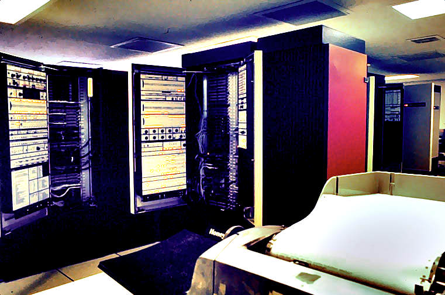
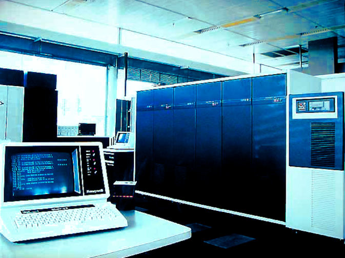

<!-- SPDX-License-Identifier: MIT
     Copyright (c) 2016-2023 The DPS8M Development Team
 -->
# DPS8M: A DPS‑8&nbsp;∕&nbsp;M mainframe&nbsp;simulator
* **DPS8M** is a simulator of the [36‑bit GE Large Systems / Honeywell / Bull 600/6000‑series mainframe computers](https://dps8m.gitlab.io/dps8m/Overview/#processor-characteristics) (Honeywell 6180, Honeywell Series‑60 ∕ Level‑68, and Honeywell ∕ Bull **DPS‑8/M**) descended from the **GE‑645** and engineered to support the [**Multics** operating system](https://swenson.org/multics_wiki/).

* **DPS8M** is [**open source software**](License_Information) developed by [**The DPS8M Development Team**](https://dps8m.gitlab.io/dps8m/master/dps8m-omnibus.pdf#the-dps8m-development-team) and [many contributors](https://dps8m.gitlab.io/dps8m/master/dps8m-omnibus.pdf#dps8m-authors-and-contributors).

|    |    |
|:--:|:--:|
|  |  |
### Project News

* [**DPS8M R3.0.1**](https://dps8m.gitlab.io/dps8m/Releases/#stable-release) released, featuring improved performance and functionality.

#### Old News

* [**DPS8M R3.0.0**](https://dps8m.gitlab.io/dps8m/Releases/Historical_Archives#dps8m-r300--2022-11-23) released &mdash; a new stable major release!

